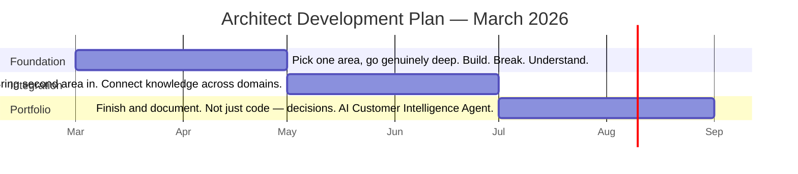

## Context

**What:** A structured personal development plan to move from Salesforce Technical Lead to hands-on architect with genuine engineering taste across cloud infrastructure, AI/ML systems, and enterprise integration.
**When:** March 2026 — 3–6 months
**Role:** Self-directed — architect of my own learning, using the Pi home lab and Kairon as live labs
**Stakes:** The intersection of enterprise systems depth + AI/ML engineering is the least competitive and most valuable place to be. This plan is the route there.

> [!NOTE]
> This is a living plan. Return to it regularly. Mark things done, add notes, change the order. The goal isn't completion — it's building habits and depth that compound over a career.

---

## The Problem

### How it was presented

Seven years of Salesforce depth, strong TypeScript, enterprise systems instinct, GCP/Terraform experience, containers. The question: what's the fastest path from Technical Lead to architect who can work across AI/ML and cloud-native systems?

### What the gap actually is

Tools can be learned. AI can generate code. What's genuinely rare is **engineering taste** — the ability to look at a system and know what's going to hurt in 18 months. That's not acquired by reading. It's acquired by being in the room when things break, owning the outcome, and carrying the lesson forward.

The honest gap isn't skills — it's the *disposition* habits that build taste over time: going below the abstraction, owning incidents end-to-end, doing the messy migration not just the clean target design, saying yes to rabbit holes.

### The angle others miss

Most people moving into AI architecture have no enterprise systems grounding. Most Salesforce architects have never built an ML pipeline. The positioning play is the intersection — not moving away from Salesforce depth, but extending the same pattern recognition across new domains. Salesforce is a launchpad, not a ceiling.

> [!TIP]
> The Pi home lab and Kairon are not side projects — they're the mechanism. Live labs that can be broken, instrumented, deliberately stressed. This is how engineering taste gets built without waiting for a job to provide the opportunity.

---

## The 3–6 Month Structure

**Month 1–2 — Foundation & Depth**
Pick one area from the technical plan and go genuinely deep — not survey-level. Build something real. Break it. Understand why it broke. The trading bot and Pi-hole are live labs — extend them, instrument them, deliberately stress them.

**Month 3–4 — Cross-Cutting & Integration**
Bring the second technical area in. Start connecting knowledge across domains — what does good observability look like for an AI system? How does network security apply to a containerised ML pipeline? The connections between domains are where architectural thinking develops.

**Month 5–6 — Portfolio & Articulation**
Finish and document the portfolio project — not just the code, but the decisions. Write up what was built, what was considered and rejected, what broke and why. This turns private learning into visible capability. The AI Customer Intelligence Agent is the centrepiece.

> [!WARNING]
> Every project must have at least one thing not fully known how to do yet. If you can predict exactly how it'll go, it's not teaching anything new. Introduce one unknown per project — a new tool, a new protocol, a new failure mode to handle.

---

## Focus Area 1 — Observability & Debugging

**The principle:** Most engineers treat observability as "add Prometheus and Grafana." Strong engineers ask: what signal actually tells me this system is healthy, versus what's just noise? Good observability is designed, not bolted on.

### Concepts to Develop

**The Three Pillars — and why they're not enough alone**

Logs tell you *what* happened. Metrics tell you *when* something changed. Traces tell you *where* time went across service boundaries. The skill is knowing which pillar to reach for first — and how to correlate across all three when a failure doesn't neatly fit one category.

- Structured logging — what makes a log actually queryable vs a wall of text
- Cardinality — why it kills your metrics system if you get it wrong
- Distributed tracing propagation — how a trace ID travels across service calls, and what breaks it

**Designing meaningful signals from scratch**

Given a system with no existing observability, what do you instrument first? This is a judgment question, not a tool question. For the trading bot specifically: what signals tell you it's *silently wrong* — placing no orders, placing duplicate orders, consuming stale data — versus just slow?

- RED method (Rate, Errors, Duration) for services
- USE method (Utilisation, Saturation, Errors) for resources
- Practice distinguishing symptoms from causes in your own systems before you can do it in others'

**Debugging distributed failures**

A failure that affects one service is straightforward. A failure that manifests in Service C because of a latency spike in Service A that caused a queue backup in Service B — that requires different thinking.

- Correlated failures vs causal failures
- Tail latency — why the 99th percentile matters more than the average
- Reading flame graphs — the fastest way to find where time is actually being spent

**Observability for AI systems — the emerging frontier**

AI systems fail in ways traditional software doesn't. A model can be technically healthy (responding fast, no errors) while being subtly wrong — drifting outputs, degraded accuracy on edge cases. Standard observability doesn't catch this.

- Model drift — how to detect it in production without ground truth labels
- Evaluation as a continuous process, not a one-time pre-deployment check
- What a "production incident" looks like for an LLM — usually not a crash, it's gradual quality degradation
- Logging LLM inputs/outputs in a way that's useful for debugging without being a privacy liability

### Projects

| Project | What it teaches | Difficulty | Status |
|---|---|---|---|
| Instrument Kairon end-to-end | Designing signals that matter for a specific system — latency distributions, order lifecycle events, data feed health | Good start | ⬜ |
| Add distributed tracing across two services | Trace propagation, understanding where time actually goes across a service boundary | Medium | ⬜ |
| Build a dashboard that tells a story, not just displays numbers | The difference between a dashboard someone uses vs one that exists for compliance. Making causality visible. | Medium | ⬜ |
| Deliberately inject a failure and diagnose it using only your observability stack | Whether your signals are actually sufficient, or whether you've been lucky | **Highly recommended** | ⬜ |

---

## Focus Area 2 — Networking & Security

**The principle:** Architects who've seen packets are disproportionately useful when things break in production — and they design better systems because they understand the constraints at the transport layer.

Pi-hole is a strong start — the goal now is to go from "I configured a tool" to "I understand what the tool is doing and why, and I can reason about network behaviour in systems I build."

### Networking Concepts to Develop

**What actually happens between `docker run` and a packet arriving**

Docker networking is an abstraction over Linux networking primitives — bridge networks, virtual ethernet pairs, iptables rules, NAT. Understanding what Docker is doing on your behalf means you can reason about why two containers can or can't communicate, debug network failures without Googling, and make informed decisions about network topology.

- Bridge mode vs host mode vs overlay networks — not just what they are but when each is the right choice
- How container port mapping actually works at the iptables level
- How Kubernetes networking extends this — CNI plugins, pod networking, service discovery

**Watch your own traffic**

Running a packet capture on traffic you generated yourself is one of the most effective ways to close the gap between "I know what HTTP/TLS/DNS is" and "I understand what HTTP/TLS/DNS does."

- Capture a DNS resolution — understand every packet: query, response, TTL, caching
- Watch a TLS handshake — identify the ClientHello, ServerHello, certificate exchange, key agreement
- Capture traffic from Kairon to its external API — see what the application actually sends over the wire

**Reverse proxy — build one from docs only**

Setting up Nginx or Caddy from documentation only (no tutorials) forces genuine understanding of virtual hosts, upstream configuration, SSL termination, header forwarding, and connection pooling.

- Understand the difference between a load balancer, a reverse proxy, and an API gateway — they overlap but are not the same
- TLS termination — understand where encryption starts and ends in the stack
- Rate limiting — understand what it's actually doing to the connection lifecycle

### Security Concepts to Develop

**Security as a design concern, not a review step**

Security bolted on after design is always weaker and more expensive than security that shapes design from the start. The goal is developing a threat-modelling instinct — asking "what could go wrong here and who would do it" as part of architecture thinking.

- OWASP Top 10 at a code level — not as a list to recite, but as failure modes you can spot in a design review
- Injection attacks at a mechanical level — why parameterised queries work where string concatenation doesn't
- Authentication vs authorisation — where each can fail and how they're separate problems

**Secrets management done properly**

Most systems have secrets in the wrong places — env vars that get logged, `.env` files that get committed, rotation that never happens. Understanding secrets management properly is both a security skill and a production reliability skill.

- The secret lifecycle — creation, rotation, revocation, audit trail
- Move Kairon credentials out of environment variables into a proper secrets store
- Symmetric vs asymmetric encryption at an intuitive level — not the maths, but when you'd use each

**Container and supply chain security**

Your containers have a dependency tree that extends back through base images, package registries, and third-party libraries. Understanding the attack surface of that dependency tree is increasingly baseline.

- Scan your own containers and actually fix the findings — don't just read the report
- Principle of least privilege applied to containers — why running as root is a problem and how to fix it
- Image layer caching and why your base image version matters for both performance and security

**mTLS — implement it between two of your own services**

Mutual TLS is where networking and security converge. Both sides authenticate each other using certificates. Setting it up from scratch, and verifying it works with a packet capture, teaches more about TLS, PKI, and service identity than any amount of reading.

- One-way TLS (server auth only) vs mTLS (mutual auth)
- Certificate chains, trust anchors, and why certificate rotation is operationally hard
- Service mesh patterns (Istio, Linkerd) — not as a shortcut, but as the production evolution of what you've done manually

### Projects

| Project | What it teaches | Difficulty | Status |
|---|---|---|---|
| Wireshark: capture and fully explain a DNS resolution and TLS handshake from your own traffic | Protocol behaviour at a packet level. Closes the gap between "I know what DNS is" and "I've seen it work." | **Start here** | ⬜ |
| Build a reverse proxy from docs only — no tutorials | Virtual hosts, SSL termination, upstream config, header forwarding. Deep understanding because you'll have to debug it. | Medium | ⬜ |
| Set up mTLS between two services in Kairon stack | Certificate lifecycle, mutual authentication, PKI basics. Verify with a packet capture. | Medium-Hard | ⬜ |
| Scan your containers, fix what you find, document the decisions | Supply chain security intuition. Understanding which CVEs actually matter vs noise. | Good practice | ⬜ |
| Migrate all Kairon secrets to a proper secrets store | Secret lifecycle, rotation mechanics, audit trail. Forces thinking about the operational reality of secrets. | **High value** | ⬜ |

---

## Focus Area 3 — AI/ML Engineering

**The principle:** The goal is not to become a research scientist or to train foundation models. It's to become the engineer who can make ML work reliably in production — understanding failure modes, building trustworthy pipelines, and bridging the gap between a model that works in a notebook and a system that works at 3am when no-one is watching.

> [!NOTE]
> The existing advantage: GCP background, Terraform skills, and enterprise systems experience put you ahead of most people approaching this from the ML side. The applied AI engineer who understands cloud infrastructure, enterprise data models, and production reliability constraints is rarer and more valuable than one who can only tune models.

### Concepts to Develop

**Why models behave the way they do — the intuition layer**

You don't need to derive backpropagation from first principles. You do need to understand enough about how models learn to reason about why a model might behave unexpectedly in production.

- Training/validation/test split — what each is protecting you against
- What overfitting looks like and why it matters for production systems receiving real-world inputs
- Why a model that works perfectly on your evaluation set can fail on production traffic — distribution shift, data leakage, evaluation set contamination
- Tokenisation and context windows at an intuitive level — how LLMs actually "see" input

**The gap between a notebook and a production system**

This is the specific gap that applied AI engineers exist to close. Most ML work happens in notebooks — exploratory, iterative, not reproducible. Taking that work and turning it into something that runs reliably, can be updated, can be monitored, and can be rolled back — that's an engineering discipline most data scientists don't have.

- Pipeline reproducibility — why the same code with the same data should produce the same model, and how that breaks in practice
- Model versioning — not just the weights, but the data version, code version, environment, and evaluation results
- Deployment options: batch inference vs real-time inference vs streaming — when to use each
- A/B testing and shadow deployment — how you safely introduce a new model version without breaking production

**LLM systems engineering — where the trajectory points**

Building systems with LLMs is different from traditional ML. Outputs are non-deterministic, failure modes are subtle, and the evaluation problem is genuinely hard. This is where Agentforce and integration experience translates most directly.

- Prompt engineering as a systems concern — not "what prompt works now" but "how do I make this robust to input variation and model updates"
- RAG (Retrieval-Augmented Generation) architecture — when it helps, when it doesn't, what can go wrong
- Agentic system patterns — tool use, planning, memory, error recovery. What does a reliable multi-step agent look like architecturally?
- Evaluation for LLM systems — why accuracy metrics don't transfer, what LLM-as-judge means and its limitations
- Context management at scale — what happens when an agent needs to maintain state across many turns or many users

**Debugging AI systems in production — the emerging skill almost nobody has yet**

When an LLM-based system behaves unexpectedly — wrong outputs, inconsistent results, latency spikes, cost explosions — diagnosing why requires a new combination of skills: prompt analysis, model behaviour understanding, distributed systems debugging, and business context awareness.

- Common LLM failure modes: hallucination, instruction following degradation, context window issues, inconsistency across similar inputs
- Building evaluation suites that catch regressions before they hit users
- The role of human feedback loops in production AI systems — not just RLHF, but as an ongoing operational concern

### Portfolio Project — AI Customer Intelligence Agent

The centrepiece. Exists at the intersection of everything: Salesforce data, GCP infrastructure, LLM orchestration, Terraform deployment, and production-grade observability. Not just a demo — evidence of the specific combination that's rare and valuable.

| Component | What it demonstrates |
|---|---|
| Salesforce as a data source | Enterprise data integration, real business context, CRM data model understanding |
| Vertex AI / GCP ML services | Cloud ML infrastructure, managed services vs custom, cost management |
| Agentforce / LLM orchestration | Agentic patterns, tool use, prompt reliability, state management |
| Terraform infrastructure | Infrastructure as code, reproducible environments, version-controlled infra |
| Observability layer | ML-specific monitoring, input/output logging, evaluation tracking, drift detection |
| Written decision log | Architectural judgment, ability to explain tradeoffs, communication |

### Projects

| Project | What it teaches | Sequence | Status |
|---|---|---|---|
| Fine-tune a small open model on a domain-specific task — evaluate it honestly | Full training loop, evaluation design, the difference between benchmark performance and production performance | Do first | ⬜ |
| Build a RAG pipeline from scratch — no framework shortcuts initially | Embedding, retrieval, reranking, context assembly. Understanding what the frameworks are abstracting. | Early | ⬜ |
| Build and document an MLOps pipeline on Vertex AI with Terraform | CI/CD for ML, model versioning, deployment automation, cost visibility | Mid-phase | ⬜ |
| Add ML-specific observability to an existing system | Input/output logging, drift detection, evaluation tracking in production | Mid-phase | ⬜ |
| AI Customer Intelligence Agent — full build with written decision log | Everything. This is the portfolio centrepiece. | Culminating | ⬜ |

---

## Salesforce as Leverage

The goal is not to go deeper into Salesforce for its own sake. It's to use the depth already there as a foundation that makes you better in adjacent domains — and as a differentiator in the market you're moving into.

**Where depth already gives an edge:** enterprise data models and business context, integration patterns at scale, production constraints and reliability thinking, stakeholder communication and governance, async processing and event-driven patterns.

**What to push beyond:** treating Salesforce as the default answer, platform-specific patterns that don't transfer, over-indexing on Salesforce certifications vs broader depth, staying in the Salesforce ecosystem bubble.

**The Salesforce internals worth understanding deeply** — not to become a better admin, but because understanding the multi-tenant architecture, governor limit enforcement, and async delivery guarantees gives a mental model for distributed systems constraints that transfers broadly:

- Governor limits as a resource isolation mechanism — what shared resources they're protecting and why multi-tenancy requires them
- Platform Events and Change Data Capture delivery guarantees — at-least-once, ordering behaviour, what happens on subscriber failure
- Bulk API at a database lock level — what happens under concurrent large upserts and why it matters for integration design

---

## Habits That Compound

Skills decay. Habits compound. The technical plan matters less than whether these habits develop.

- [ ] **Read code more than you read articles.** GitHub is more valuable than Medium. Pick a library used regularly and read the source — understand it at a level that makes you dangerous in discussions.
- [ ] **Build things with no stakeholders.** Side projects with no deadlines and no political constraints let you take real risks. The learning density is higher than anything work-mandated. The trading bot is the right instinct — protect it.
- [ ] **Maintain a "how does this actually work" habit.** Every time you use an abstraction, occasionally go one level below it. Not always — but regularly enough that your mental model stays accurate.
- [ ] **Write about what you build — even internally.** The act of writing forces clarity. Clear technical writing is rare and builds reputation. Architecture Decision Records, postmortems, internal walkthroughs — these compound.
- [ ] **Inject one unknown per project.** If you can predict exactly how a project will go, it's not teaching anything new. Deliberately include one thing you don't fully know how to do.
- [ ] **Stay connected to the frontier without being distracted by it.** Know what's happening at the leading edge of your domains. Be sceptical of hype. Follow engineers building things, not people tweeting about things.
- [ ] **Occasionally make your work visible.** A well-documented GitHub repo, an internal tech talk, a meetup presentation. Not for the optics — because explaining forces precision, and reputation travels further than your current room.

---

## Decision Log

| Decision | Options considered | What I chose | Why | What I'd change |
|---|---|---|---|---|
| Career direction | Deeper Salesforce specialisation; pivot to pure ML; intersection play | Intersection — Salesforce + AI/ML + cloud infrastructure | Least competitive, most valuable, already have the foundation | — |
| Learning vehicle | Courses / reading; structured programme; live lab | Pi home lab as the primary vehicle | Learning density is higher when you own the outcome and can break things | — |
| Phase sequencing | Start with ML (most exciting); start with observability; start with networking | TBD — pick based on what Kairon needs most right now | The plan should serve the live system, not the other way around | — |

> [!NOTE]
> Update this table as decisions get made. "What I'd change" is not failure — it's proof of carrying lessons forward.

---

## The Narrative

An architect who built a live algorithmic trading system from first principles — not as a demo, but as a production system with real money, real failure modes, and real observability problems to solve. Used that as the lab to develop the specific combination that's rare: enterprise systems depth, cloud-native infrastructure, and LLM systems engineering. Grounded in Salesforce, not limited by it.

> [!TIP]
> Return to this and refine it as the plan progresses. The best version of this narrative gets written by doing the work first.

---

## Target State

> An architect with genuine hands-on depth across cloud infrastructure, AI/ML systems, and enterprise integration — who can drop into a codebase, diagnose a production failure, design a trustworthy AI system, and explain the tradeoffs clearly to both engineers and stakeholders. Grounded in Salesforce, not limited by it.

| Dimension | Where I am now | Where this plan takes me |
|---|---|---|
| Systems thinking | Strong — 7 years of production experience | Extended to distributed systems, AI/ML failure modes |
| Infrastructure | Terraform, GCP, containers — solid | ML infrastructure, security posture, networking depth |
| Observability | Functional but not designed | Deliberate signal design, distributed tracing, AI monitoring |
| Security | Awareness level | Design-level thinking, secrets management, container security |
| AI/ML engineering | Integration and orchestration experience | Full pipeline ownership, MLOps, LLM systems debugging |
| Mindset | Strong instincts, some caution | Deliberately uncomfortable, owns incidents, goes below the abstraction |

---

## Energy Log

**What's energising about this direction:**

**What to watch for:**

**Would I do this kind of work again?**

> [!NOTE]
> Fill this in as you go. The pattern across entries over time is more valuable than any single answer.

---

## The One Thing to Protect

> The thirst to know how something actually works — to see the code, the config, the packet. That's not a skill. It's a disposition, and it's the rarest thing. Everything else on this list is learnable. That isn't. Don't let delivery pressure or comfort gradually erode it.

---

## Related

- [[networking-concepts-explained]] — networking concepts covered in this plan already built on Pi-hole
- [[docker-explained]] — container fundamentals already in place
- [[dobby-explained]] — live example of agentic LLM systems engineering already in production
- [[pihole-reference]] — the live lab referenced throughout this plan
