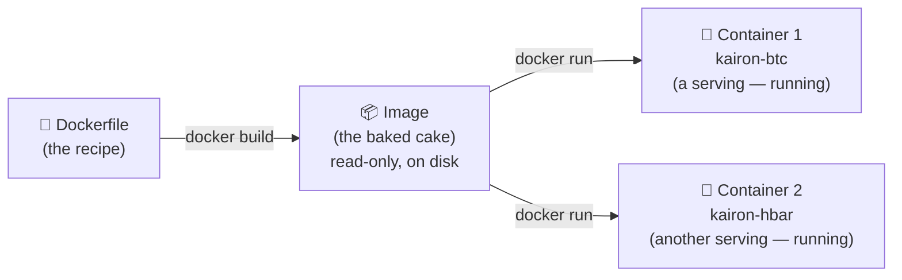
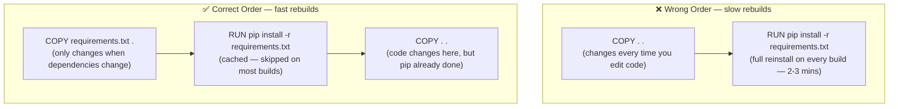
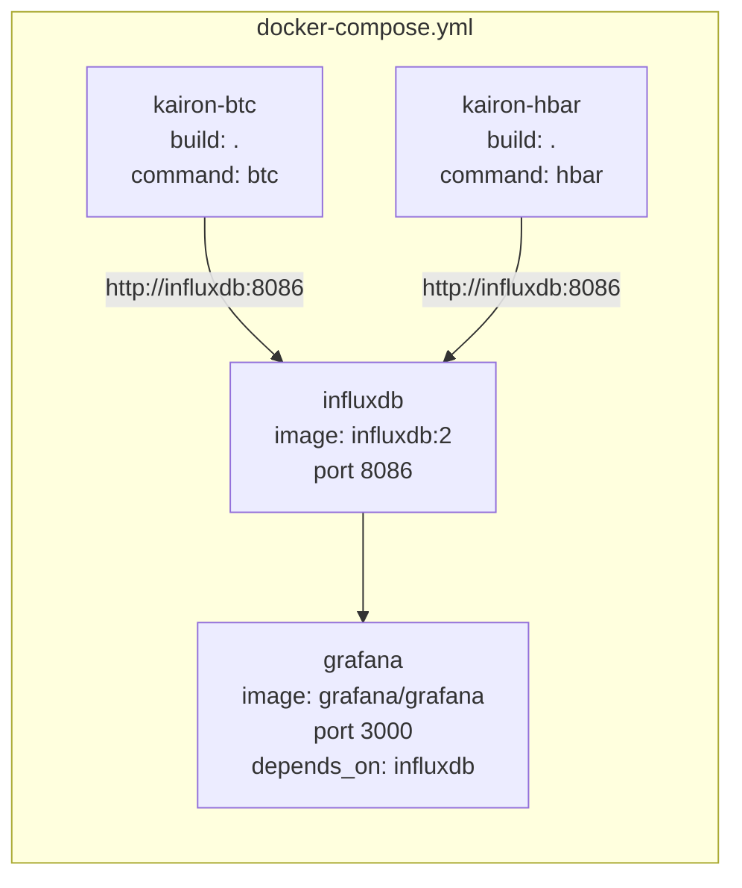

## Why This Matters

Every service on the Pi — Kairon, InfluxDB, Grafana, Pi-hole — runs in Docker. When a container crashes, won't start, or behaves unexpectedly, you need to understand what Docker is actually doing to diagnose it. When you change a Dockerfile and the rebuild takes 3 minutes instead of 5 seconds, you need to know why. Docker's model is simple once you see it — but it has a few gotchas that bite everyone until they click.

> [!NOTE]
> The Kairon stack uses Docker Compose to manage multiple containers as a single unit. Pi-hole uses a specific Docker networking mode (`network_mode: host`) that differs from all other services. Both are explained here.

---

## The Simple Version

Docker lets you package a program and everything it needs — Python, libraries, config — into a single self-contained unit that runs the same way on any machine. You write a recipe (Dockerfile), bake it into a snapshot (image), and run that snapshot as many times as you want (containers). Each run is isolated — containers don't know about each other unless you wire them together.

---

## The Mental Model

**The analogy:** Docker is a cake recipe system.

A **Dockerfile** is the recipe — ingredients and steps. An **image** is the baked cake — a read-only snapshot sitting on disk, not doing anything. A **container** is a serving of that cake — actually running, consuming resources. You can slice many servings from one cake. If you want a different cake, you change the recipe and bake again.



> [!TIP]
> The class vs object analogy also works perfectly here — an image is a class definition, a container is an instance. You can run many containers from one image, just as you can create many objects from one class. Changing the image doesn't affect already-running containers, just like changing a class definition doesn't affect existing instances (until you rebuild).

---

## How It Works

### The Dockerfile — Writing the Recipe

A Dockerfile is a sequence of instructions that define what goes into an image. Each instruction creates a **layer** — a diff on top of the previous state.

```dockerfile
FROM python:3.13-slim      # Start with Python pre-installed
WORKDIR /app               # All subsequent commands run from here
COPY requirements.txt .    # Copy just the dependency list first
RUN pip install -r requirements.txt  # Install dependencies (cached layer)
COPY . .                   # Copy the rest of the code
ENTRYPOINT ["python", "bot.py"]  # Fixed executable
CMD ["btc"]                # Default argument (overridable)
```

| Instruction | What it does | When it runs |
|---|---|---|
| `FROM` | Base image to build on top of | Build time |
| `WORKDIR` | Sets working directory inside container | Build time |
| `COPY` | Copies files from host into the image | Build time |
| `RUN` | Executes a shell command | Build time |
| `ENV` | Sets an environment variable | Build time + runtime |
| `EXPOSE` | Documents which port the app uses | Documentation only |
| `ENTRYPOINT` | Fixed executable — always runs | Runtime |
| `CMD` | Default arguments — overridable at runtime | Runtime |
| `VOLUME` | Declares a mount point for persistent data | Runtime |

---

### Layer Caching — Why Dockerfile Order Matters

Every instruction in a Dockerfile creates a cached layer. If an instruction hasn't changed since the last build, Docker reuses the cached layer and skips re-running it. The moment any layer changes, **all subsequent layers are invalidated and must rebuild from scratch**.

This has a critical practical consequence — order matters enormously:



> [!TIP]
> The rule: put things that change rarely near the top, things that change often near the bottom. Dependencies (requirements.txt) change infrequently. Your code changes constantly. Copy them in that order — dependencies first, code second.

---

### CMD vs ENTRYPOINT — The Kairon Pattern

These two instructions work together and are frequently confused:

- **`ENTRYPOINT`** — the fixed executable. Can't be overridden at runtime (without `--entrypoint` flag).
- **`CMD`** — the default arguments. Can be overridden by anything you put after the image name in `docker run`.

```
ENTRYPOINT ["python", "bot.py"]  +  CMD ["btc"]
→ default behaviour: python bot.py btc

docker run kairon hbar
→ runtime override: python bot.py hbar
```

This is exactly how Kairon runs two pairs from one image — same code, different argument (pair name). Docker Compose uses `command: btc` and `command: hbar` to set the pair per container.

---

### Volumes — Containers Are Ephemeral by Default

A container's filesystem is destroyed when the container is removed. Any files written inside the container — logs, databases, config — are gone. This is intentional isolation, but it means you must explicitly declare what you want to persist.

There are two types of volumes:

**Bind mount** — you specify a path on the host. The host path and container path are the same folder. Changes on either side are immediately visible on the other.

```
-v ~/kairon/logs:/app/logs
     ↑ host path    ↑ container path
```

Good for: log files, configs you want to edit directly on the Pi.

**Named volume** — Docker manages the storage location. You give it a name; Docker decides where it lives on disk.

```
-v influxdb-data:/var/lib/influxdb2
     ↑ volume name  ↑ container path
```

Good for: databases (InfluxDB, Grafana). You don't care where the data lives — you just care that it survives container restarts.

> [!WARNING]
> `docker system prune -a` removes all images not associated with a running container. `docker volume prune` removes volumes not attached to any container. Always run `docker ps -a` and `docker volume ls` before pruning on a production Pi — data loss from volume pruning is permanent.

---

### Docker Compose — The Full Stack in One File

Running individual `docker run` commands for each service gets unwieldy fast. Docker Compose lets you define your entire stack in one `docker-compose.yml` and manage it as a unit.



`docker compose up -d` starts everything. `docker compose down` stops everything. `docker compose up -d --build` rebuilds changed images and restarts.

> [!WARNING]
> `docker compose restart` does **not** pick up new environment variables. It only sends a stop/start signal to the existing container process. To pick up `.env` changes, you need a full `docker compose up -d` (which recreates the container). This is a common gotcha that burns time.

---

### Networking — How Containers Talk

Compose creates a shared bridge network for all services in the same file automatically. Containers on this network can reach each other by **service name** — Docker resolves the name to the container's internal IP.

```
# Kairon's code connects to InfluxDB like this:
http://influxdb:8086

# Not the Pi's IP, not a container IP — the service name
# Docker resolves "influxdb" → 172.19.0.4 internally
```

Port mapping (`-p 3000:3000`) exposes a container port to the outside world. Without it, a container's port is only reachable from other containers on the same Docker network — not from your Mac, not from the Pi's LAN.

```
ports:
  - "3000:3000"
   ↑ Pi port  ↑ container port
# Now accessible at http://192.168.1.45:3000 from your Mac
```

> [!NOTE]
> Pi-hole is the exception. It uses `network_mode: host` which removes Docker's virtual network entirely and binds the container directly to the Pi's real network interfaces. With host mode, the `ports:` key does nothing — it's already on the host network. See [[pihole-reference]] for why.

---

### Secrets — The .env Pattern

Never hardcode API keys or passwords in a Dockerfile or compose file. Use a `.env` file and tell Compose to inject it:

```bash
# .env (never commit this file)
BINANCE_API_KEY=your_key_here
BINANCE_API_SECRET=your_secret_here
```

```yaml
# docker-compose.yml
services:
  kairon-btc:
    env_file: .env    # injects all keys as environment variables
```

```python
# bot.py reads them with:
import os
key = os.environ.get("BINANCE_API_KEY")
```

Always include a `.dockerignore` file to prevent `.env` from being accidentally baked into the image during `COPY . .`:

```
.env
.git/
venv/
__pycache__/
*.pyc
*.log
```

> [!WARNING]
> If `.env` is missing from `.dockerignore` and you run `COPY . .`, your API keys get baked into the image layer. If that image is ever pushed to a registry (Docker Hub, GHCR), those keys are exposed. Always `.dockerignore` your `.env`.

---

### Restart Policies — Surviving Reboots

A container with no restart policy exits and stays dead if the Pi reboots. Set `restart: unless-stopped` on anything that should survive.

| Policy | Behaviour | Use for |
|---|---|---|
| `no` | Never restart (default) | One-off scripts, testing |
| `always` | Restart always, even after manual `docker stop` | Rarely useful |
| `unless-stopped` | Restart always, except if *you* manually stopped it | ✅ Kairon, Pi-hole, Grafana, InfluxDB |
| `on-failure` | Only restart on non-zero exit code | Batch jobs |

`unless-stopped` is the right default for home-lab services — it survives reboots and crashes, but respects intentional stops during maintenance.

---

## So What

Docker's model means you can reason about failures in layers: is the image broken (rebuild), is the container config wrong (check env / volumes / ports), is it a networking issue (check bridge vs host, port mapping, service names)? The ephemeral-by-default model also means you always need to ask "where does this data live?" before removing a container — named volumes survive, anonymous filesystem writes don't.

---

## Concepts at a Glance

| Concept | What it is | Analogy | Example |
|---|---|---|---|
| Dockerfile | Recipe defining what goes into an image | Cake recipe | `FROM python:3.13-slim` |
| Image | Read-only snapshot built from a Dockerfile | Baked cake — on disk, not running | `kairon:latest` |
| Container | Running instance of an image | A serving of cake | `kairon-btc` |
| Layer | Each Dockerfile instruction creates a diff | Page in the recipe | `RUN pip install` |
| Layer cache | Docker reuses unchanged layers | Skipping steps you've already done | Unchanged `pip install` = instant |
| `ENTRYPOINT` | Fixed executable — always runs | The oven — can't skip it | `python bot.py` |
| `CMD` | Default arguments — overridable | What you put in the oven — swappable | `btc` or `hbar` |
| Bind mount | Host folder mapped into container | Shared folder between two people | `~/kairon/logs:/app/logs` |
| Named volume | Docker-managed persistent storage | A storage unit Docker owns | `influxdb-data` |
| Docker Compose | Manages a multi-container stack as one unit | A conductor for an orchestra | `docker-compose.yml` |
| Bridge network | Docker's virtual network for containers | Internal office network | `172.19.0.x` |
| `network_mode: host` | Container shares the Pi's real network directly | Removing the office walls | Pi-hole |
| Port mapping | Exposes a container port to the host/LAN | Opening a window in the office | `3000:3000` |
| Service name | Containers reach each other by name, not IP | Internal phone extension | `http://influxdb:8086` |
| `.env` | File of secrets injected as env variables | Sealed envelope of credentials | `BINANCE_API_KEY=...` |
| `.dockerignore` | Prevents files being copied into the image | Packing list exclusions | Keeps `.env` out of image |
| `restart: unless-stopped` | Container restarts on crash/reboot, but not manual stop | Auto-start on boot | Kairon, Grafana, InfluxDB |

---

## Further Reading

| Resource | Type | Why it's worth it |
|---|---|---|
| [Docker — Get Started](https://docs.docker.com/get-started/) | Docs | Official walkthrough — Dockerfile → image → container in order |
| [Docker Compose Overview](https://docs.docker.com/compose/) | Docs | Compose file reference and how multi-service stacks work |
| [Digging into Docker Layers](https://jessicagreben.medium.com/digging-into-docker-layers-c22f948ed612) | Article | Visual explanation of layer caching and why order matters |

---

## Related

- [[docker-reference]] — full command list, compose file patterns, Dockerfile instruction table, cleanup commands
- [[pihole-reference]] — the `network_mode: host` exception and why Pi-hole needs it
- [[networking-concepts-explained]] — how Docker bridge networking fits into the broader home network picture
