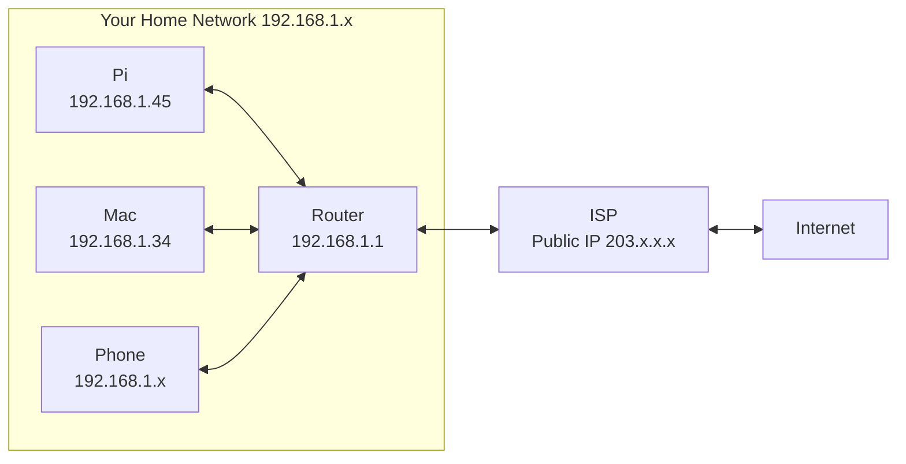
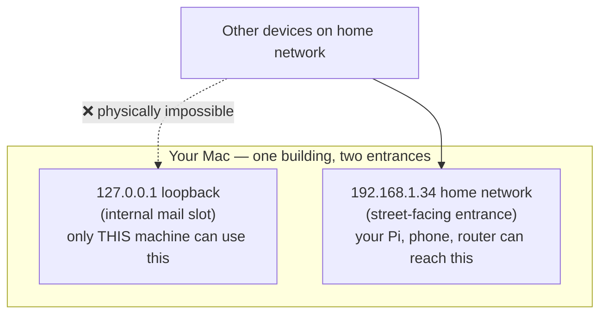
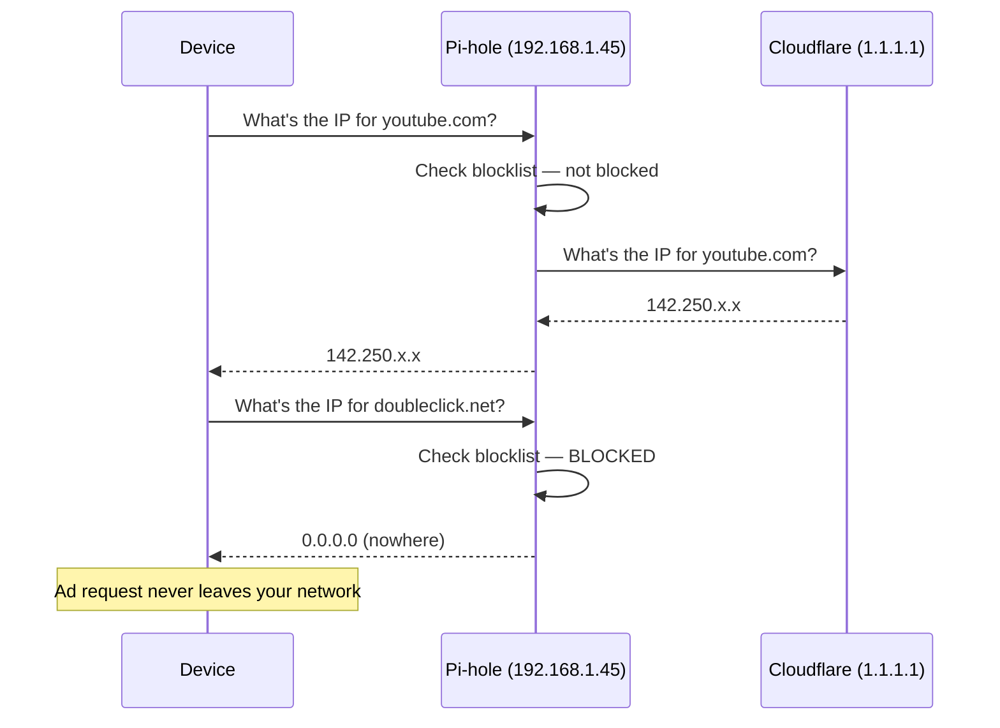
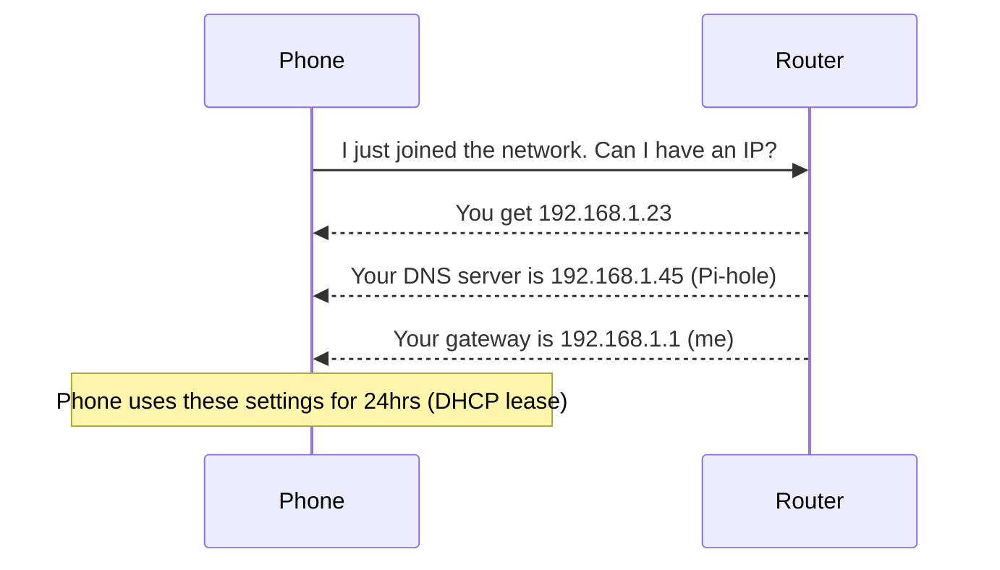
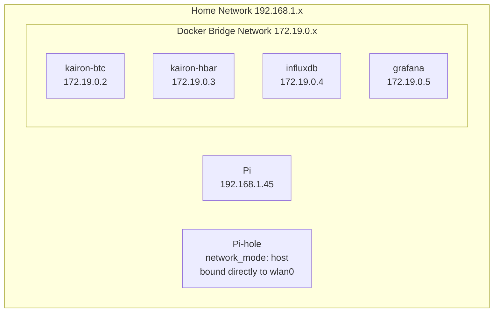
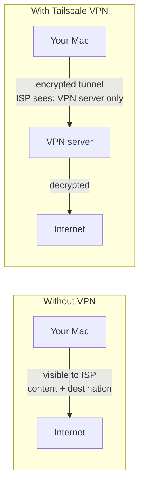
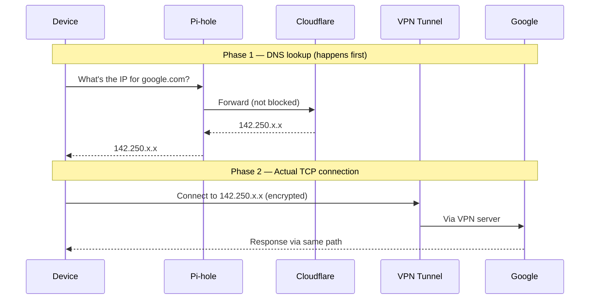
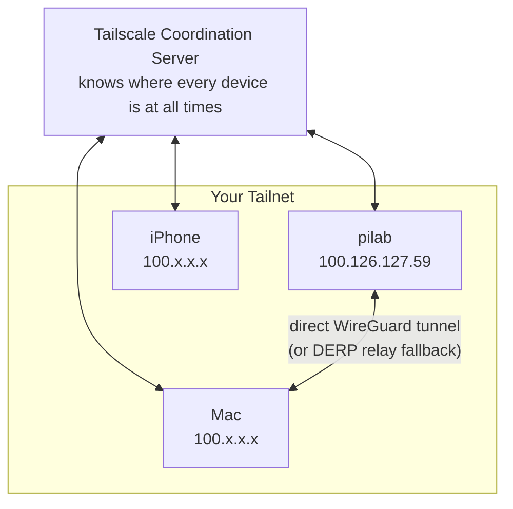
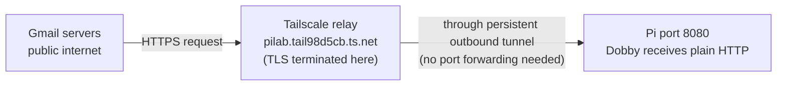

## Why This Matters

Every service on the Pi — Pi-hole, Grafana, Kairon, Dobby — lives on a network. When something stops working, you need to reason about *where* the breakdown is: is it DNS? A port not exposed? The wrong binding address? A NAT layer blocking inbound traffic? Without the mental models, you're guessing. With them, you can trace a problem from symptom to cause in minutes.

> [!NOTE]
> These concepts came up repeatedly across the Pi-hole setup, OpenClaw/Dobby networking, and the Tailscale Funnel build. This note consolidates everything into one place.

---

## The Simple Version

Your home network is a building. Every device has a room number (IP address). Every program running on a device has an apartment number inside that room (port). When programs want to talk to each other, they knock on the right door. Some doors face the building's internal hallways only (loopback). Some face the street but only within your neighbourhood (LAN). Some face the entire city (internet). A VPN adds a secret private entrance that only people with a key can use — from anywhere in the world. DNS is the building directory. DHCP is the receptionist that assigns rooms. NAT is the building's reception desk that handles all mail coming in from outside.

---

## The Mental Model

**The analogy:** your home network is an apartment building, and every concept in networking maps to something in that building.

Your router is the building management office — it assigns room numbers (DHCP), maintains the directory (DNS forwarding), and handles all mail from outside (NAT). Your Pi is one room in that building. Every service running on the Pi is a specific apartment inside that room, with its own door number (port). The internet is the city outside. Tailscale is a private members club with branches everywhere — only keyholders get in, regardless of which city they're physically in.

> [!TIP]
> The key reframe: "private" in networking doesn't mean disconnected. It means *only certain people can get in*. Your home network is private. Tailscale is private. Neither cuts you off from the internet — they just control who can reach what.

---

## How It Works

### IP Addresses — Room Numbers

Every device on a network needs an address so data knows where to go. There are two kinds:

| Type | Range | Who can reach it | Example |
|---|---|---|---|
| Private | `192.168.x.x`, `10.x.x.x`, `172.16.x.x` | Only devices on your home network | Pi at `192.168.1.45` |
| Public | Everything else | Anyone on the internet | Your router's ISP address `203.x.x.x` |

Your Pi's address (`192.168.1.45`) **only exists inside your home**. From a café, that address doesn't mean anything — it's like trying to call an internal office extension from outside the building. This is why Tailscale is needed for remote access.



**NAT — how one public IP serves every device**

Your router has a single public IP from your ISP. When your Mac makes a request to Google, the router swaps the private source address (`192.168.1.34`) for its own public IP (`203.x.x.x`) on the way out, and swaps it back on the way in. This is NAT (Network Address Translation). The NAT table is the router's memory of which internal device made which outgoing request — so replies can be delivered to the right room.

> [!WARNING]
> NAT is also why the Pi is invisible to the internet by default. Nobody outside can *initiate* a connection to `192.168.1.45` — the router has no NAT table entry for an inbound connection that nobody started. This is your home network's default security model. Port forwarding intentionally punches a hole through it.

---

### Ports — Apartment Numbers

An IP address gets data to the right device. But a device runs many programs simultaneously — your browser, Grafana, InfluxDB, SSH. Ports are how incoming data knows which program it's for.

```
Pi (192.168.1.45) — the building
├── Port 22     SSH              "knock here to get a shell"
├── Port 53     Pi-hole DNS      "knock here for DNS lookups"
├── Port 3000   Grafana          "knock here for dashboards"
├── Port 8086   InfluxDB         "knock here for time-series data"
└── Port 8080   OpenClaw/Dobby   "knock here for the AI gateway"
```

When you type `http://192.168.1.45:3000`, the `:3000` means "this building, apartment 3000." When you type `http://google.com`, your browser assumes port `80` or `443` — those are standard conventions browsers just know.

> [!TIP]
> A port is only "open" when two conditions are both true: a program is *listening* on it, and it's *reachable* from where you're trying to connect. Listening without exposure = private. Exposure without a listener = connection refused.

---

### Loopback — The Internal Mail Slot

Your device has a special network interface called loopback, at `127.0.0.1` (also called `localhost`). Traffic sent here never leaves the machine — it's a door that only the machine itself can knock on.



**What "binding" means**

When a program starts, it chooses which entrance to open its door on. This choice is called *binding*:

```
127.0.0.1:8080    → loopback only  — internal traffic only, nothing external can reach it
192.168.1.45:8080 → LAN only       — home network can reach it, internet cannot
0.0.0.0:8080      → all interfaces — every entrance open: loopback + LAN + any VPN
```

> [!WARNING]
> `0.0.0.0` as a **binding** address means "all interfaces" — a wildcard that opens every entrance simultaneously. As a **destination** address (what Pi-hole returns for blocked domains) it means "nowhere." Same characters, completely different meaning depending on context.

---

### Open Ports — Security Implications

Knowing what's listening where is how you reason about your attack surface:

| Bound to | Who can reach it | Risk |
|---|---|---|
| `127.0.0.1` (loopback) | Only the same machine | ✅ No risk — fully private |
| `192.168.1.x` (LAN) | Anyone on your home WiFi | ⚠️ Low — home network only |
| `0.0.0.0` + port forwarded | Anyone on the internet | 🔴 High — publicly exposed |
| Tailscale IP | Only your authenticated Tailscale devices | ✅ Low — trusted devices only |

**Port forwarding** tells your router: "when someone from the internet knocks on port X, forward it to device Y on my home network." It intentionally punches a hole through the NAT layer. Never forward ports you don't need to — each forwarded port is a potential attack surface that bypasses your default NAT protection.

---

### DNS — The Directory

DNS (Domain Name System) translates human-readable names into IP addresses. Computers communicate using IPs, but humans use names. DNS is the translation layer between the two.



Pi-hole sits between your devices and the internet's DNS servers. Because your router pushes Pi-hole's address as the DNS server to every device via DHCP, every device on the network — phones, TVs, smart speakers — uses Pi-hole automatically, with no configuration on each device.

> [!WARNING]
> If Pi-hole goes down and there's no fallback DNS set, the whole network appears to have no internet — even though the connection is fine. DNS failure looks identical to "no internet" from a user's perspective. Always set `1.1.1.1` as secondary DNS in the router.

---

### DHCP — The Receptionist, and MAC Addresses

**DHCP** (Dynamic Host Configuration Protocol) automatically assigns IP addresses when a device joins the network. It doesn't just hand out an IP — it hands out a full config packet: IP address, DNS server, and default gateway.



This DHCP mechanism is what makes Pi-hole work network-wide. When we changed the router's DNS setting to point at Pi-hole, it started including `192.168.1.45` in every DHCP response — so every new device automatically used Pi-hole without any device-level config.

**MAC addresses** are permanent hardware IDs burned into every network card at the factory. Unlike IP addresses (dynamic, assigned by DHCP), MAC addresses never change.

| Property | IP Address | MAC Address |
|---|---|---|
| Changes? | Yes — DHCP assigns it | Never — factory burned |
| Scope | Network routing | Local network identity |
| Format | `192.168.1.45` | `88:A2:9E:8E:FB:F0` |
| Analogy | Desk number | Employee badge number |

**DHCP reservation** uses the MAC address to lock a device to a fixed IP. The router sees the Pi's MAC on every connection request and always assigns it the same address. This is critical for Pi-hole — if the Pi's IP changed after a reboot, the router's DNS setting would be pointing at the wrong device and the whole network would lose DNS.

> [!WARNING]
> If you switch the Pi from WiFi (`wlan0`) to ethernet (`eth0`), the MAC address changes — each interface has its own. You'd need to update the DHCP reservation to the `eth0` MAC, or the Pi gets a random IP on the next reboot.

---

### Docker Networking — Containers in Their Own World

By default, Docker containers live in a virtual network Docker manages internally — completely separate from your home network.



**Port mapping** is how you expose a container to the outside. `ports: "3000:3000"` in compose means: "when traffic arrives at the Pi on port 3000, forward it into the container's port 3000." Left side = Pi (host). Right side = container.

Containers in the same Compose stack can reach each other by service name — Docker resolves `influxdb` to its container IP automatically. Kairon connects to InfluxDB at `http://influxdb:8086`, never needing to know the actual container IP.

**Why Pi-hole needs `network_mode: host`**

In bridge mode, DNS queries arriving on `wlan0` weren't being routed correctly through Docker's virtual network to the Pi-hole container. `network_mode: host` removes the virtual network entirely — the container binds directly to the Pi's real network interfaces. There's also a port 53 conflict: Docker's internal DNS also wants port 53. Running Pi-hole in host mode sidesteps both problems at once.

> [!TIP]
> `network_mode: host` is the right tool when a container needs to receive traffic directly from the physical network — not just from other containers. Common cases: Pi-hole, VPN servers, network monitoring tools. Note: when you use it, the `ports:` key in compose does nothing — the container is already on the host network.

---

### HTTP vs HTTPS — What Anyone Can See

HTTP sends everything as plain readable text — like a postcard. Anyone between you and the server can read it. HTTPS wraps the content in encryption — like a sealed letter. The envelope is still visible, but not the contents.

| With HTTPS | ISP **can** see | ISP **cannot** see |
|---|---|---|
| | That you connected to `amazon.com.au` (via SNI) | What you searched for |
| | When and for how long | What you ordered |
| | How much data moved | Your payment details |
| | The domain name | The specific page URL |

> [!NOTE]
> SNI (Server Name Indication) is a small label browsers attach to HTTPS connections so servers know which certificate to use. It leaks the domain name in plain text. Newer browsers are adding Encrypted Client Hello (ECH) to fix this, but it's not universal yet.

With plain HTTP, your ISP — and anyone on the same WiFi — can see everything: full URLs, full responses, login credentials. This is why public WiFi + HTTP was genuinely dangerous before HTTPS became standard.

---

### VPNs — A Third Entrance

A VPN creates an encrypted tunnel between devices. It's a private members club with branches everywhere — only devices with your key can enter, from anywhere in the world.



**The armoured car:** a VPN doesn't replace the internet — it uses the internet to carry its encrypted packets. Your traffic still travels on the same public roads. But it's inside an armoured car. Anyone who intercepts it en route sees a locked box, not the contents.

| Protection | Hides content? | Hides which sites? | Hides timing/volume? |
|---|---|---|---|
| HTTPS only | ✅ Yes | ❌ No (domain visible via SNI) | ❌ No |
| VPN only | ✅ Yes (tunnel encryption) | ✅ Yes | Partially |
| HTTPS + VPN | ✅ Yes | ✅ Yes | Mostly |

> [!NOTE]
> For the Pi home lab, VPN means Tailscale — built on WireGuard, installs in one command, gives each device a permanent `100.x.x.x` address reachable from anywhere. From a café with WiFi off, `ssh pi` over Tailscale works exactly as if you were home.

---

### VPN Internals — How Packets Actually Move

**DNS and the connection are two separate phases.** This is a common confusion point.



> [!WARNING]
> When a VPN is active on a device, DNS queries typically bypass Pi-hole and go through the VPN's own DNS servers. Pi-hole's query stats drop for VPN-connected devices — this is expected, not a bug.

**The NAT table** is the router's conversation log — a table in memory mapping each outgoing connection to the internal device that started it. When replies come back, the router matches the row and delivers to the right device. Unsolicited inbound connections get dropped because there's no matching row — this is your home network's default security posture.

---

### Tailscale — The Members Club in Detail

Every device on your tailnet gets a unique `100.x.x.x` address that belongs to that device permanently, regardless of physical location. These are *not* public IPs — a stranger cannot reach `100.126.127.59` without being authenticated on your tailnet.



When your Mac wants to reach the Pi, Tailscale installs a virtual interface (`tailscale0`), asks the coordination server for the Pi's current location, and attempts a direct encrypted WireGuard tunnel between the two — even through NAT. If direct connection fails, it falls back to Tailscale's relay servers (DERP). Slower, always works.

**Tailscale Funnel** exposes one specific port on the Pi to the *public internet*, not just your tailnet. Tailscale's servers relay the traffic and handle the TLS certificate. The Pi maintains a persistent outbound connection to Tailscale — inbound requests from Gmail arrive at the public URL and get pushed through that existing connection. Your NAT router allows this because the tunnel was initiated from inside.



> [!TIP]
> Funnel only exposes the specific port you configure — nothing else on the Pi becomes public. No router changes required. The public URL stays stable even if your ISP changes your home IP. Far safer than port forwarding.

> [!NOTE]
> See [[tailscale-funnel-reference]] for the exact setup commands, current Pi Funnel URL, webhook endpoint, and how to verify it's working from outside your home network.

---

## So What

Understanding this stack means you can trace any network problem back to first principles. "Why can't Gmail reach Dobby?" → is Funnel running? Is the port listener up? Is the webhook URL correct? "Why did everyone lose internet?" → did Pi-hole go down? Is the fallback DNS set? "Why can't I reach Grafana from outside?" → it's on a LAN port, not exposed via Tailscale. Each question has a specific, diagnosable answer. You're not guessing — you're tracing a path.

---

## Concepts at a Glance

| Concept | What it is | Analogy | Example |
|---|---|---|---|
| IP address | Device's address on a network | Building street address | `192.168.1.45` |
| Private IP | Only reachable inside home network | Internal office extension | `192.168.1.x` |
| Public IP | Internet-facing address (your router's) | Building's public street address | `203.x.x.x` |
| NAT | Router translates private IPs to one public IP | Reception forwarding all calls | `192.168.1.34` → `203.x.x.x` |
| NAT table | Router's memory of active outgoing connections | Reception's call register | Maps `192.168.1.34:54210` → Google |
| Port | Numbered channel on a device | Apartment number | `:3000` (Grafana) |
| Binding | Which interface a program listens on | Which entrance to put your door on | `0.0.0.0` vs `127.0.0.1` |
| Loopback | Internal-only address, never leaves machine | Internal mail slot | `127.0.0.1` |
| `0.0.0.0` (bind) | Listen on all interfaces — every entrance open | All entrances unlocked | OpenClaw gateway |
| `0.0.0.0` (dest) | No address / nowhere | No forwarding address | Pi-hole blocked domains |
| Port forwarding | Router sends external traffic to specific device | Receptionist directing outside calls inward | External `:80` → Pi `:80` |
| DNS | Translates domain names to IPs | Phone book | `google.com` → `142.250.x.x` |
| DHCP | Auto-assigns IPs and network config to devices | Receptionist assigning desk numbers | Router gives phone `192.168.1.23` |
| DHCP reservation | Always gives same IP to specific MAC | Permanently reserved desk | Pi always gets `.45` |
| MAC address | Permanent hardware ID burned into network card | Employee badge number | `88:A2:9E:8E:FB:F0` |
| Docker bridge | Virtual network for containers inside a host | Internal office network inside the building | `172.19.0.x` |
| `network_mode: host` | Container shares host's real network directly | Removing the internal office walls | Pi-hole needs this |
| HTTPS | Encrypted HTTP — content hidden, domain visible via SNI | Sealed letter | Your bank, Google |
| HTTP | Plain text — everything visible to anyone in the path | Postcard | Old forums |
| VPN | Encrypted tunnel — content and destination hidden from ISP | Armoured car on public roads | Tailscale |
| Tailscale tailnet | Private network of your authenticated devices | Members club — keyholders only, anywhere | `100.x.x.x` addresses |
| Tailscale Funnel | Exposes one port publicly via Tailscale relay — no port forwarding | Members club with one public service window | `pilab.tail98d5cb.ts.net` |
| `wlan0` | WiFi network interface on Linux | The WiFi radio card | Pi on WiFi |
| `eth0` | Ethernet network interface on Linux | The physical cable port | Pi on ethernet |

---

## Further Reading

| Resource | Type | Why it's worth it |
|---|---|---|
| [How DNS Works — Cloudflare](https://www.cloudflare.com/en-gb/learning/dns/what-is-dns/) | Article | Clean visual walkthrough of the full DNS resolution chain |
| [How NAT Works — Cloudflare](https://www.cloudflare.com/en-gb/learning/network-layer/what-is-nat/) | Article | Explains the NAT table and why it protects your home network by default |
| [How Tailscale Works](https://tailscale.com/blog/how-tailscale-works) | Blog | The definitive explainer on WireGuard, NAT traversal, and the coordination server |
| [Julia Evans — Networking Zines](https://wizardzines.com/) | Zines | The best visual explainers for networking concepts — DNS, HTTP, and more |
| [MDN — HTTP Overview](https://developer.mozilla.org/en-US/docs/Web/HTTP/Overview) | Docs | Clear breakdown of HTTP vs HTTPS and what the encryption actually covers |

---

## Related

- [[tailscale-funnel-reference]] — setup commands, current Pi Funnel URL, webhook endpoint, and how to verify from outside home
- [[pihole-reference]] — Pi-hole compose file, admin commands, and troubleshooting
- [[docker-explained]] — how Docker bridge networking and `network_mode: host` fit the bigger picture
