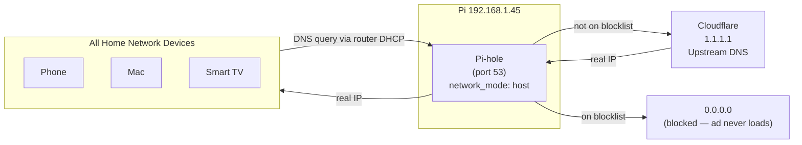

## Overview

**What:** Pi-hole is a network-wide DNS-based ad blocker running as a Docker container on the Pi.
**Why:** Blocks ads and trackers for every device on the home network — phones, TVs, smart speakers — without installing anything on each device.
**Mental model:** Pi-hole sits between your devices and the internet's DNS servers. When a device asks "what's the IP for `doubleclick.net`?", Pi-hole checks its blocklist and returns `0.0.0.0` (nothing) instead of the real IP. The ad server is never contacted.

> [!NOTE]
> Pi-hole runs with `network_mode: host` — not the default Docker bridge network. This is intentional and required. See [[networking-concepts-explained]] for the full mental model on why.

---

## Architecture



---

## How It Works

### Step 1 — Install Pi-hole as a Docker container

Pi-hole runs via Docker Compose. The compose file lives on the Pi at `~/pihole/docker-compose.yml`.

### Step 2 — `network_mode: host` (critical)

By default, Docker containers live in a virtual network (`172.19.0.x`) isolated from the home network. DNS queries from WiFi devices weren't reaching the Pi-hole container in bridge mode.

`network_mode: host` removes the virtual network entirely — Pi-hole binds directly to `wlan0` (or `eth0`). DNS queries from every device on the network hit Pi-hole directly.

> [!WARNING]
> When using `network_mode: host`, the `ports:` key in the compose file does nothing and should be omitted. The container is already on the host network — there's nothing to map.

### Step 3 — DHCP reservation (lock the Pi's IP)

The Pi's IP must never change. The router is configured to always assign `192.168.1.45` to the Pi's MAC address (`88:A2:9E:8E:FB:F0`). Without this, a reboot could give the Pi a different IP and break DNS for the entire network.

> [!WARNING]
> If you switch the Pi from WiFi to ethernet, the MAC address changes — `wlan0` and `eth0` have different MACs. Update the DHCP reservation in the router to the `eth0` MAC before switching, or the Pi will get a random IP on the next reboot.

### Step 4 — Set router DNS to Pi-hole

In the Netgear router DNS settings:
- **Primary DNS:** `192.168.1.45` (Pi-hole)
- **Secondary DNS:** `1.1.1.1` (Cloudflare fallback)

The router pushes these DNS settings to every device on the network via DHCP. This is what makes Pi-hole network-wide — no config needed on individual devices.

> [!WARNING]
> The secondary DNS (`1.1.1.1`) is non-negotiable. If Pi-hole crashes or the Pi reboots, devices fall back to Cloudflare automatically. Without it, one Pi reboot = the entire network appears to have no internet.

---

## Key Decisions

| Decision | Why | Trade-off |
|---|---|---|
| `network_mode: host` instead of bridge | DNS queries from `wlan0` didn't route correctly through Docker's virtual network | Container is no longer network-isolated — it shares the Pi's full network stack |
| DHCP reservation over static IP on Pi | Keeps IP management in one place (the router), rather than configuring static IPs on each device manually | Requires router access to change |
| Cloudflare `1.1.1.1` as upstream DNS | Better privacy than Google's `8.8.8.8` (Google's default in Pi-hole) | — |
| Secondary DNS set at router level | Network survives Pi restarts without anyone losing internet | Devices on secondary DNS bypass Pi-hole's blocklist during fallback |
| Pi-hole v6 — `FTLCONF_webserver_api_password` | v6 renamed the password env var; old `WEBPASSWORD` silently fails and Pi-hole assigns a random password | Many tutorials online still show the old variable name |

---

## Reference

### docker-compose.yml

```yaml
services:
  pihole:
    image: pihole/pihole:latest       # official Pi-hole image from Docker Hub
    container_name: pihole            # fixed name so `docker logs pihole` works

    network_mode: host                # bypass Docker's virtual network
                                      # binds directly to Pi's wlan0/eth0
                                      # note: ports: key does nothing here — omit it

    environment:
      TZ: Australia/Melbourne         # timezone for correct log timestamps
      FTLCONF_webserver_api_password: "yourpassword"
                                      # Pi-hole v6 variable name — NOT WEBPASSWORD

    volumes:
      - pihole_data:/etc/pihole       # blocklists, config, SSL cert
      - dnsmasq_data:/etc/dnsmasq.d   # DNS settings

    restart: unless-stopped           # critical — Pi-hole down = network DNS down

volumes:
  pihole_data:
  dnsmasq_data:
```

> [!WARNING]
> Pi-hole v6 renamed the password environment variable. `WEBPASSWORD` (v5) silently fails in v6 — Pi-hole starts up and assigns a random password with no error. The correct variable is `FTLCONF_webserver_api_password`.

---

### Verification Commands

```bash
# Test DNS resolution through Pi-hole (should return a real IP)
nslookup google.com 192.168.1.45

# Test ad blocking (should return 0.0.0.0)
nslookup doubleclick.net 192.168.1.45

# Check Pi-hole container is running
docker ps | grep pihole

# Follow live DNS query log
docker logs -f pihole

# Check what's listening on port 53 (DNS)
sudo ss -tulpn | grep :53
```

---

### DHCP Reservation — Netgear Router

```bash
# Step 1: Get the Pi's MAC address
ip link show wlan0 | grep ether    # WiFi
ip link show eth0  | grep ether    # Ethernet (use this after switching)
```

Router UI path: `http://192.168.1.1` → Advanced → Setup → LAN Setup → Address Reservation → Add

| Field | Value |
|---|---|
| MAC Address | `88:A2:9E:8E:FB:F0` (wlan0) |
| IP Address | `192.168.1.45` |

Save → reboot the Pi → verify IP hasn't changed with `hostname -I`.

---

### Admin Dashboard

| URL / Path | Purpose |
|---|---|
| `http://192.168.1.45/admin` | Pi-hole web UI |
| Dashboard → Query Log | Live view of every DNS query on the network |
| Dashboard → Blocklist | Add or remove blocklists |
| Settings → DNS | Change upstream DNS (switch from Google to Cloudflare `1.1.1.1`) |
| Settings → Whitelist | Allow a domain that Pi-hole is incorrectly blocking |

---

### Current Network State

```
Router:       192.168.1.1      # Netgear — DHCP server, DNS forwarder
Pi (pilab):   192.168.1.45     # Static via DHCP reservation
Mac:          192.168.1.34     # Dynamic

Primary DNS:  192.168.1.45     # Pi-hole
Secondary DNS: 1.1.1.1         # Cloudflare fallback
Pi-hole admin: http://192.168.1.45/admin
```

---

### Troubleshooting

| Symptom | Likely Cause | Fix |
|---|---|---|
| DNS queries timing out from other devices | Docker bridge network not routing `wlan0` traffic to container | Switch to `network_mode: host` in compose file |
| Pi-hole assigned a random password on startup | Using old `WEBPASSWORD` env var (Pi-hole v5 only) | Use `FTLCONF_webserver_api_password` for v6 |
| Whole network loses internet | Pi-hole down and no secondary DNS set | Set secondary DNS to `1.1.1.1` in router |
| Pi-hole IP changed after reboot | No DHCP reservation set | Add MAC → IP reservation in router DHCP settings |
| Site broken / won't load | Legitimate domain on blocklist | Check Query Log in admin UI → whitelist the domain |
| Devices still using old DNS after router change | DHCP lease hasn't expired yet | Disconnect + reconnect WiFi on each device, or wait for lease to expire |

---

## Related

- [[networking-concepts-explained]] — mental models for DNS, DHCP, `network_mode: host`, and why each setup step matters
- [[docker-explained]] — Docker bridge vs host networking in full detail
